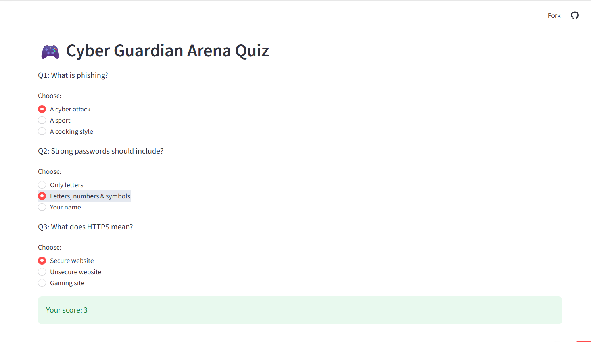
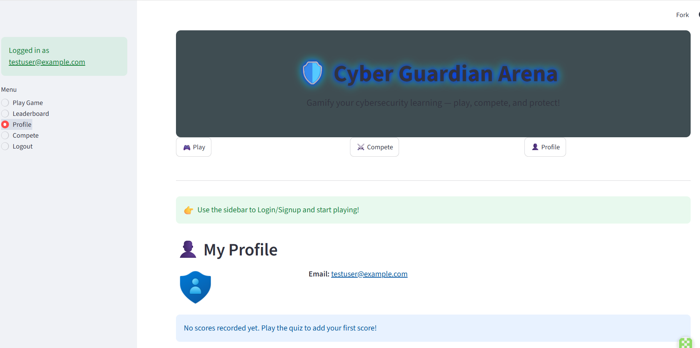
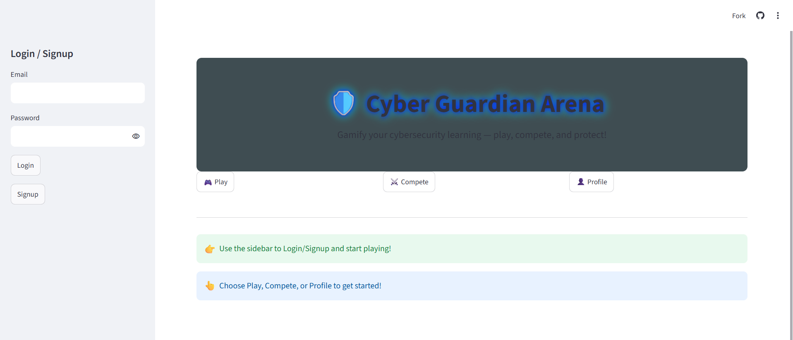
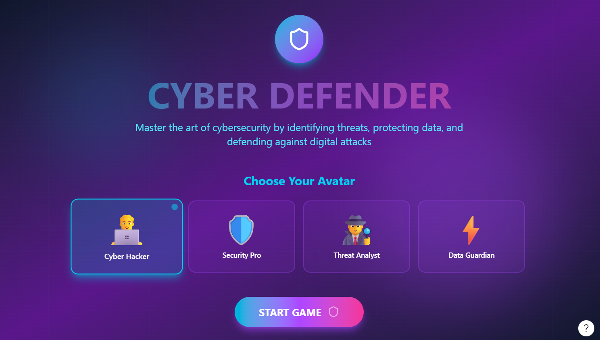

# 🛡️ Cyber Guardian Arena

An interactive gamified platform to teach **cybersecurity awareness** — built with Python, Streamlit, and Supabase.  
Players can **log in, play quizzes, compete on the leaderboard, and track their progress** in a fun, engaging way.

🔴 [Live Demo](https://cyber-guardian.streamlit.app) | ⭐ Star this repo if you find it useful!

---

## 🚀 Features
- 🎮 **Play Quiz**: Answer cybersecurity questions and test your knowledge.
- 🏆 **Leaderboard**: Compete with others and see top scores.
- 👤 **Profile**: Track your progress and scores (coming soon).
- 🔐 **Authentication**: Secure login/signup powered by Supabase.
- 🌐 **Responsive UI**: Cyber‑themed design with glowing text and icons.

---

## 🛠️ Tech Stack
- **Frontend**: [Streamlit](https://streamlit.io/)  
- **Backend**: [Supabase](https://supabase.com/) (Auth + Database)  
- **Language**: Python  
- **Database**: PostgreSQL (via Supabase)  

---

## 📂 Project Structure
```
Cyber-Guardian/
├── src/
│   ├── app.py              ← Main Streamlit app
│   ├── requirements.txt    ← Dependencies
│   └── README.md           ← Project info
├── .streamlit/             ← Streamlit config (optional)
└── assets/                 ← Images, icons, or static files

---
```
Code

---

## ⚡ Getting Started

### 1. Clone the repo

git clone https://github.com/Udayasri527/remix-of-cyber-guardian-arena.git
cd remix-of-cyber-guardian-arena
### 2. Install dependencies
bash
pip install -r requirements.txt
### 3. Set up Supabase
Create a Supabase project.

Add a scores table with columns: id, email, score, created_at.

Enable email/password auth.

Add your SUPABASE_URL and SUPABASE_KEY to environment variables.

### 4. Run the app
bash
streamlit run app.py
📸 Screenshots
Homepage with cyber background and glowing hero text

Quiz interface

Leaderboard view
## 📸 Screenshots

### Project Setup


### Quiz Page


### Profile Page



📌 Roadmap
## 📌 Roadmap


👩‍💻 Author
Udayasri — B.Tech Computer Science student
[](https://github.com/Udayasri527)